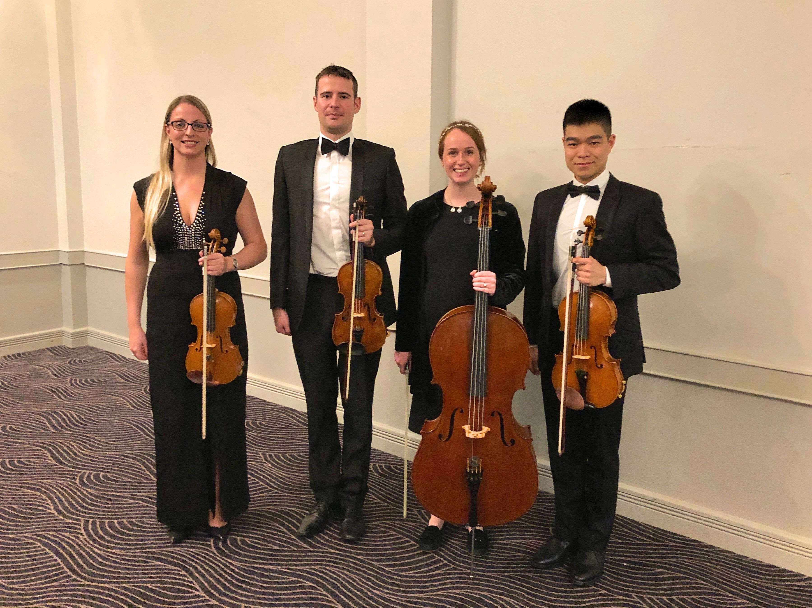
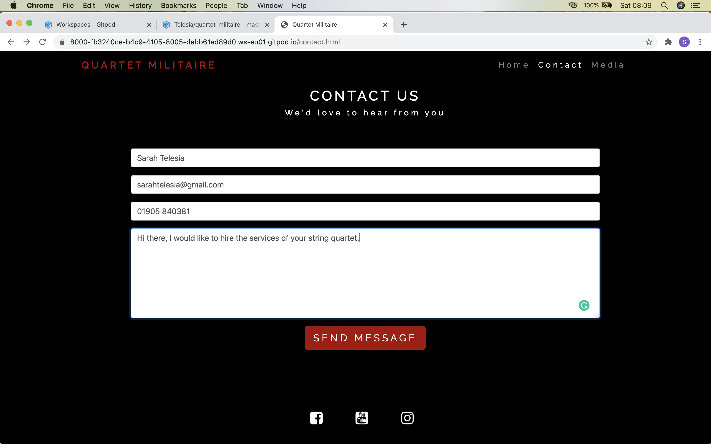
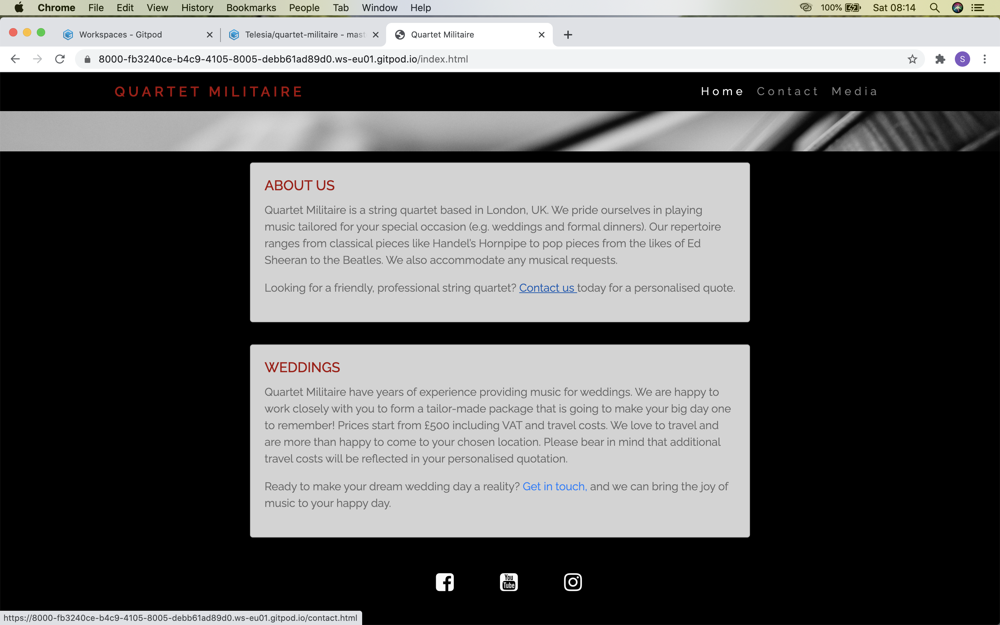

# Website for Quartet Militaire

## Code Institute Milestone Project 1: User-Centric Frontend Development
Quartet Militaire are a professional UK based string quartet providing tailored music for your special occasion. 
I play in the string quartet myself, but it does not yet have a website, so I wanted to create one for my first 
milestone project. 
The players in the string quartet all met whilst serving as military musicians and that is where the brand name 
grew out of. 
The website will provide information on how to contact Quartet Militaire and what their musical specialism is.
A stand out hero image and video of the ensemble will entice users to buy their services and provide an idea
to users of the type of music available to them.
Users will be able to access a contact form to easily send a message to Quartet Militaire in order to make 
specific enquires and check their availability.

A link to the website can be found [here](https://telesia.github.io/Quartet-Militaire/)

## UX
## Strategy 

The Quartet Militaire website is for users who are looking to hire a string quartet. They may be looking for 
musical services for a personal function such as a wedding, christening or party. Equally, music could be 
required for a corporate occasion, concert or charity event. These are just some generic examples of where a 
string quartet could be used. 
The website for Quartet Militaire will entice any user looking to hire a string quartet as within the field 
of music, although it is great to have a specific target audience, which I will describe below, you do not 
want to limit your horizons of being hired.
One specific target audience of Quartet Militaire would be couples aged 25-40 looking for music for their 
wedding. These users will want to view clear information about how Quartet Militaire can fit into their 
occasion (price, willingness to travel, musical selection) so they can book an appropriate ensemble that 
fits their tastes and budget.

#### As a user I want to:
* listen and/or view an example of Quartet Militaire performing to be impressed by their style and musical standard.
* view an image/video of them to see how they would look if hired at an event to check the level of professional output.
* learn about the string quartet’s location in order to know if they are local, or willing to travel to, the location of event required at.
* easily contact the string quartet to find out availability for a specific date and discuss any individual needs.
* view approximate package costs to see if the service is affordable for a user budget.
* view a repertoire list of musical pieces that the quartet can perform.
* view testimonials from satisfied customers to lend authenticity to the services of the string quartet.
* be easily directed to any social media channels that can add additional viewing material to entice a user 
to connect with the quartet and ultimately buy their services as a result. 
* be able to instinctively navigate the website to find the information required efficiently. 

## Scope

After analysis of the user stories, I have decided that I cannot implement all user's needs at this time 
so have decided on the below features to be my initial minimum scope.

* About us 
* Wedding package information
* Contact form
* Embedded video
* Satisfied customer quote
* Responsive design

## Structure

I wanted the structure of the website to reflect a user's prior experience and researched other string quartet websites in order to 
ascertain current structure trends. Although, I found some were using one page scroller sites, most had a traditional navbar to different pages and I
opted for this as Quartet Militaire are marketing themselves as a traditional musical ensemble. 

I have structured the site with:

* a navbar to the right hand side and brand logo to the left as is familiar to users.
* a collapsible navbar hamburger icon for smaller devices to save space.
* main written content in Bootstrap cards for a mobile first design.
* social media icons placed in the footer.

## Skeleton

I designed wireframes for mobile, tablet and desktop using Balsamiq. 

All three pages of the website are viewable in PDF using the following link: 

[Wireframes for home page, contact page and media page](assets/wireframes/quartet_militaire_wireframes.pdf) 

## Surface

Colours

A dark, bold colour theme has been chosen to create a feel of an evening performance and to tie in with the military themed 
branding of Quartet Militaire. 

Black 
White #fafafa
Red rgb(167, 9, 9)
Grey #696969
Lightgray

Typography:

I have chosen to use the Raleway font throughout the website.

## Features
#### All website pages:
* A navbar features across all pages. It shows the Quartet Militaire brand logo on the left and on the right the 3 pages 
in order of user priority: home, contact and media. The navbar collapses into a hamburger button when viewed on smaller screen devices.
* A footer that includes social media links to Facebook, YouTube and Instagram. It has been purposefully designed in a minimalist 
fashion for full user impact. 
#### Home Page:
* A large ‘hero’ image of someone playing the violin. A high quality, modern and artsy stock image to give users a first impression of
 a professional musician. 
The colour choice of the ‘hero’ image also ties in with the black background.
* A floated quotation using a Bootstrap card from a satisfied customer draws attention to the services Quartet Militaire provide and below is a quick press
 contact button to lead the user straight to the contact page. The contact button is featured because of a mobile first design mindset. It 
 makes the contact page easy to navigate to when a user first lands on the website using any device.
* The about section uses a Bootstrap card and features gives an overall biography of Quartet Militaire.
* The wedding section uses a Bootstrap card and provides key information when hiring the string quartet specifically for a wedding. It sets out a minimum 
package price for users because this was an important piece of information for users when setting out the strategy.
#### Contact Page:
* A Bootstrap contact form with space for name, email, telephone and a message; with a button to send featured at the bottom of the form. 
* The name and email fields are required.
* The email field must have the correct email format in order to submit.
* The colours have been amended to tie in with the colour scheme of the site. 
#### Media Page:
* An embedded YouTube video of a string quartet. Please be aware this is not Quartet Militaire, but shows an example of live recorded music for 
this project's purposes. Users can control actions on the video to create a good user experience. 
* Subtitle on media page is hidden on smaller screen devices. This is to allow a quick and easy view of the contact page and 
not take up too much 'retail' space.

#### Features Left to Implement:
* A download button in the navbar and footer, which takes users to a new browser tab where they can view a list of individual
 musical pieces in different genre categories. This would provide users with a visual idea of musical choices that they can 
 read through and see if any of their preferred musical ideas are present. 
* A more comprehensive wedding article building on the one already featured and moved to a separate page. This page would then
 be able to offer more photographs of Quartet Militaire at a wedding and provide further text explaining a typical run down 
 of services provided by the quartet at weddings. This would be a useful feature to users because when paying for services 
 at a wedding you want to know exactly what you are getting, what the expectation is of length of performance in the case 
 of a string quartet.
* Good quality imagery and video of Quartet Militaire to be created and used throughout website. At present the website 
has taken stock imagery and borrowed media for the purposes of this project from Youtube.
* Another webpage including a list of repertoire, which would be displayed in musical genres for a good user experience. 
* I would like to complete the contact form so that it has usable function once I have learned how to do this.

## Technologies Used

* HTML5

    The project uses HTML5 as the main language of the website.

* CSS3

    The project uses CSS3 to style the website’s pages.

* Bootstrap v4.5

    The project uses Bootstrap elements to help with form and design.

* Javascript

Used to implement the functionality of the burger button.

* GitHub

    The project uses GitHub to store its code.

* Gitpod

    The project uses Gitpod as the IDE.

* Git

Used within Gitpod as the version control system.

* Google Developer tools

Used within Google Chrome to inspect pages to help solve any bugs and view responsive design features.

* Balsamiq

    The project uses Balsamiq to create wireframes.

* Google Fonts

Used to import the font style.

## Testing

I used Google Chrome Developer Tools throughout the project. This was an invaluable resource to check how HTML and CSS changes would look.
It was a particularly useful tool to have when checking for responsiveness on difference sized devices. In particular, when 
checking the embedded YouTube video worked on smaller screen devices in horizontal view. The video is best viewed in horizontal mode
on tablet and mobile devices. Another way the Developer Tools were useful was for viewing the Bootstrap navbar, cards and contact form. 
I had used the Bootstrap responsive classes in order to make sure they filled the screen on smaller devices. 
I am happy with the mobile first design of the website and the way it looks clear and easy to read on a mobile sized device. With current trends
in how users are viewing websites a mobile first design and good user experience on small devices is crucial.
The website also lends itself to tablet sized devices. The only criticism for viewing on a tablet sized device
is that the Contact page and Media page have some dead space that could be utilised. 

When I first viewed my Contact page using the Developer Tools in Chrome, I noticed that the heading and subheading for the page pushed the contact form 
lower down on smaller device sizes. This meant that the user experience would be hindered and visually it was not appealing. I decided to use media 
queries to hide the subheading for smaller devices to eliminate this visual issue.

I used the Lighthouse tool to check over my website in the final tests. The red colour I had been using throughout my site was flagged up as not being 
acceptable for accessibility. I have therefore changed the red colour in the final stages to a more suitable contrast red to the black background. This
is something I would not have been aware of otherwise.

Overall, I am more happy with the way my website views on a mobile device than on some of the larger screen sizes. With mobile first design
in mind, this is ok for my first project; in future I would like to develop the layout and design of the desktop view for the Quartet Militaire website.

### W3C Validator Testing

I used the W3C validators for both HTML and CSS to check my code. On the final test there were no errors found. There were a few errors throughout my work on the project that I corrected as I went along. I realise now
that it would have been a useful exercise to log these errors and perhaps add to my write up as part of an ongoing testing routine. One last issue I came across was with my semantic html where
I needed to use <main> instead of <section> on the Media page to elimate the need to have a heading present, which had flagged up as a warning.

### Web Browser and Device Testing

I have viewed and tested my website on Google Chrome and Safari on both a Macbook Pro and a larger desktop screen and all features work fine and
the viewing experience look ok.

Aside from checking through all devices sizes using Google Developer Tools to view and test my website, I have also viewed and tested my site on an iPhone 7 and iPad (large).

#### Testing User Stories Write Up

**I want to listen and/or view an example of Quartet Militaire performing to be impressed by their style and musical standard.**
   
and

**I want to view an image/video of Quartet Militaire to see how they would look if hired at an event to check the level of professional output.**
    
1. Go to the Media page
2. Try to play the video by clicking on the play button in centre of embedded video
3. Youtube controls become viewable
4. User can select video controls
5. Try to pause video, change volume, mute, and full screen and all YouTube features are working

**I want to learn about the Quartet Militaire's location in order to know if they are local, or willing to travel to, the location of my event**

1. Click on Home page
2. Scroll to About and Wedding sections
3. User can read information, which tells them the string quartet are London based and willing to travel

**I want to easily contact Quartet Militaire to find out availability for a specific date and discuss any individual needs.**

1. Go to Contact page
2. Contact form is instantly viewable on all screen sizes
3. User can fill out name, email, telephone and a message and click 'send message' button to send
4. Try to submit form without a valid name in text area and error message seen
5. Try to submit email with an invalid email and form requires a correct email format including @ sign otherwise error message seen
6. Telephone number and message are not required to send form as expected
7. Fill in all form areas with correct information and no further error messages seen

In addition, I added extra links on the Home page to the contact page within the content. I felt pointing users to the contact form was one
of the most important features of the website. 

1. Click on Home page
2. Click contact us button below quote on Home page and internal site link works and takes you to the Contact page.
3. Press on intergrated internal page links in About and Wedding sections and both take you to Contact page.

**I want to view approximate package costs of Quartet Militaire to see if the service is affordable for my budget.**

1. Go to Home page
2. Scroll to Wedding section and written content explains a minimum package price

**I want to view a repertoire list of musical pieces that the quartet can perform.**

1. This feature has not been implemented yet.

**I want to view testimonials from satisfied customers to lend authenticity to the services of Quartet Militaire**

1. Go to Home page
2. Customer quote is the first thing you read within the main content of the page

**Be easily directed to any social media channels that can add additional viewing material to entice a user to connect with the quartet and ultimately buy their services as a result.** 

The social media links are visually clear for users within the footer of all three pages. I tested each page seperately using the below steps:

1. Try to click on Facebook icon and taken to Facebook homepage
2. Try to click on YouTube icon and taken to YouTube homepage
3. Try to click on Instagram icon and taken to Instagram homepage

### Deployment

The repository for the project is held on GitHub and was created by Sarah Telesia.
The deployment involved using the settings within the Quartet Militaire repository to enable the website to be deployed as a GitHub page, which you can access
at https://telesia.github.io/Quartet-Militaire/

**Steps on how to clone the Quartet-Militaire repository from GitHub**

I have learned and taken the information for the below clone steps from https://docs.github.com/en/github/creating-cloning-and-archiving-repositories/cloning-a-repository

There are two options:

Clone using GitHub Desktop

1. Open GitHub website and navigate to Quartet-Militaire repository on Sarah Telesia's GitHub at https://github.com/Telesia/Quartet-Militaire
2. Above the list of files, click on Code button
3. Scroll down to read 'Open with GitHub Desktop' and then click
4. This will open GitHub Desktop (If this is your first time using GitHub Desktop follow the software download procedure)
5. A pop up will ask you where you wish to clone the repository to on your local computer and then press clone
6. You can now access the repository files in your chosen IDE

Clone using Git 

1. Open GitHub website and navigate to Quartet-Militaire repository on Sarah Telesia's GitHub at https://github.com/Telesia/Quartet-Militaire
2. Above the list of files, click on Code button
3. Click on the web URL viewable and copy
4. Open the terminal
5. Change the current working directory to the location where you want the cloned directory
6. Type git clone, and then paste the URL you copied earlier
7. Press Enter to create your local clone.6. 
8. You can now access the repository files in your chosen IDE

### Credits

**Code**

Code credit to Sean Whelan for the contact form. Taken from https://codepen.io/SeanWhelan/pen/avMWqQ 

Code credit for mobileHide class and css to http://docs.minionmade.com/developer-tools/show-hide-specific-content-on-mobile-devices 

**Content**

The about section was written by Joseph Yu for Quartet Militaire's Facebook Page. 
All other content is my own.

**Media**

* The Youtube video was obtained from The Wedding Quartet's page at https://www.youtube.com/embed/7QIHJBi2os8
* The image on the homepage was obtained from https://unsplash.com/ Credit to: Joel Wyncott

**Acknowledgements**

Thank you to my mentor Spencer Barriball for his help and assistance throughout the project. 
In particular, he helped me add Javascript functionality to my burger button and checked through the features for responsiveness.